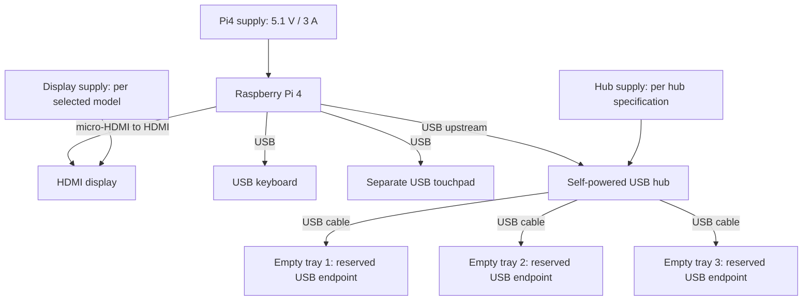

# ModuDeck electrical project — revision 0.1
Date: 2026-10-02. Preliminary design, not a validated PCB or build-ready power system.

## Scope and architecture
PC plus three empty trays. Raspberry Pi 4 is the current candidate. Keep the trays mechanically stackable but use ordinary USB cables for first-prototype data. No custom combined power/data docking connector is wired in this revision.

Display USB touch is optional and needs a spare hub port. Choose at least four downstream ports if all three tray endpoints and display touch will be used. The hub must prevent backfeeding power into the Pi through its upstream USB connection. Verify this in the chosen hub's documentation before connecting separate supplies. Do not join the positive outputs of separate supplies.

For the candidate Waveshare HDMI LCD (H), external 5 V / 2 A power is discussed in its documentation. Final display revision, jack polarity and power/USB interaction must be verified. The Pi4 3 A supply is not the budget for all floors and the display.

## Circuit A — first prototype power
Use manufacturer's complete external regulated supplies and original input connectors:
- PSU-PC -> Pi4 USB-C input.
- PSU-LCD -> the selected display's documented power input.
- PSU-HUB -> the selected self-powered hub's documented input.
- USB and HDMI provide their normal cable ground connections; no extra rail joining.
Only low-voltage wiring is inside the enclosure. No internal mains wiring in this revision.

The future single-input distribution circuit is in [power-distribution.svg](power-distribution.svg). It is a functional proposal only: fuse, switch, regulator, protection devices and wire ratings cannot be assigned until loads and source are selected. It is not used in the first prototype.

## Circuit B — optional tray identification test
Keep empty trays empty by default. If desired, test ONE temporary Raspberry Pi Pico identification board on the bench before mounting one in each tray. Pico is powered only by its own USB connector in this test.

| Net | Connection |
|---|---|
| LED_STATUS | Pico GP0 -> R1 1 kΩ -> LED1 anode |
| Ground | LED1 cathode -> Pico GND |
| BUTTON | Pico GP1 -> normally-open pushbutton -> Pico GND |
| Input bias | Configure GP1 with its internal pull-up |
| USB | Host/hub USB -> Pico micro-USB using a data cable |

Use GPIO names, not physical pin numbers, and confirm the selected board pinout before wiring. GPIO logic is 3.3 V: never connect USB 5 V to a GPIO. LED current is at most approximately 3.3 mA with 1 kΩ, and lower after subtracting LED forward voltage. This only tests indicator/button functionality; USB serial identification requires firmware and a host program, neither implemented in this revision. It does not switch or measure expansion power.

See [tray-test-circuit.svg](tray-test-circuit.svg). Suggested identification fields: protocol_version, unique_board_id, tray_name, button_state. Labels identify the device, not its physical stack position; automatic floor position detection is deferred.

## Deferred circuits
Batteries, charging, high-current outputs, electrical docking and hot-plug sequencing. Phone and dialing keypad have been removed from the project.

## Verification plan
1. Select display and hub models, power connections and USB backfeed behavior.
2. Run Pi + keyboard + touchpad on the bench; check system undervoltage indications.
3. Connect independently powered display and compliant hub according to their manuals.
4. Test one optional Pico LED/button circuit with USB power only.
5. Measure actual current and cable voltage drop before designing a shared power PCB.
6. Define fuse ratings, conductor sizes, regulator thermal limits and connector ratings from measured loads.
7. Check revised enclosure fit and cooling before mounting.

No electrical tests have been performed. This folder does not contain a KiCad schematic, PCB layout or manufacturing files.

## Primary references
- https://www.raspberrypi.com/documentation/computers/getting-started.html
- https://www.raspberrypi.com/documentation/computers/raspberry-pi.html
- https://www.raspberrypi.com/products/type-c-power-supply/
- https://www.waveshare.com/wiki/7inch_HDMI_LCD_(H)
- https://datasheets.raspberrypi.com/pico/pico-datasheet.pdf
- https://www.raspberrypi.com/documentation/microcontrollers/micropython.html
