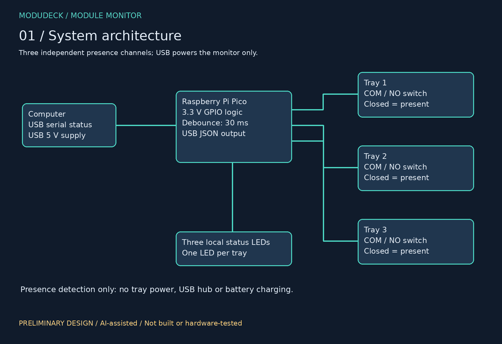
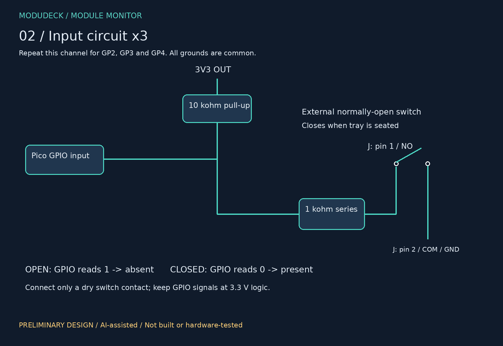
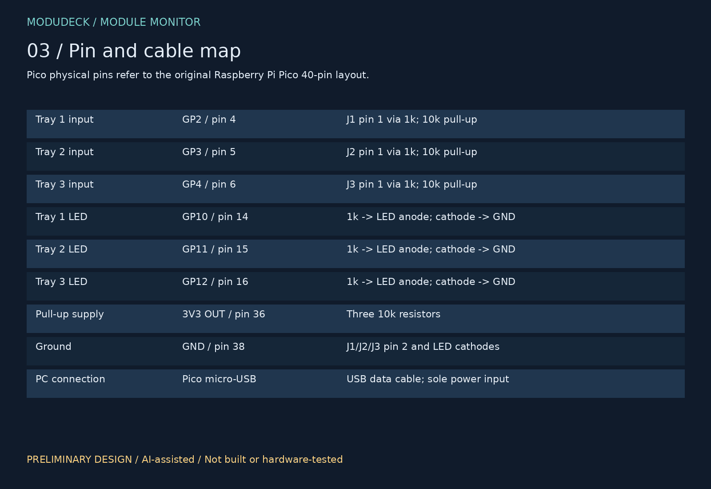
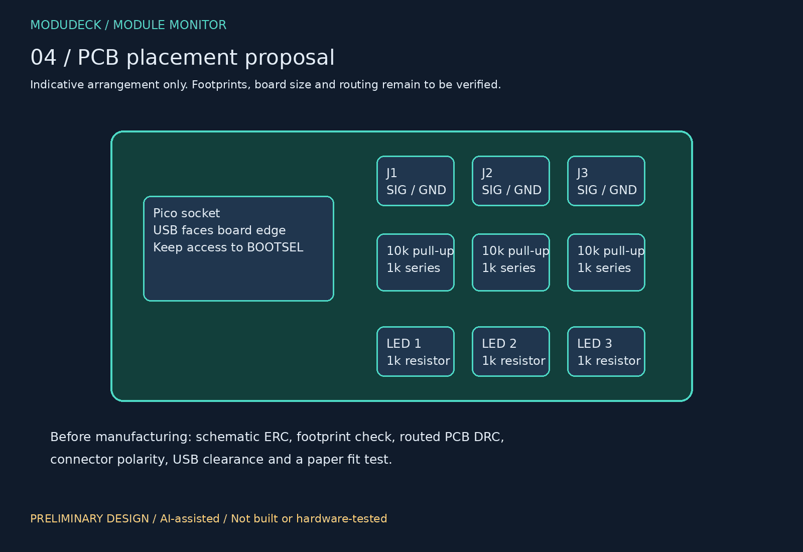

# ModuDeck Module Monitor — preliminary design

An AI-assisted, USB-powered presence monitor for three stackable trays. This is a new electronics subproject within ModuDeck. The original ThinkPad motherboard is reused, not redesigned.

## Status
Architecture, connection plan, firmware draft and conceptual PCB placement are provided. Firmware debounce logic passed host-side tests for bouncing contacts, release and timer wrap. No hardware test has been performed. These drawings are design documentation, not photographs of a build. There are no verified KiCad board/schematic or manufacturing files in this package yet. Do not submit the placement illustration as a routed PCB.

## Circuit
Use an original Raspberry Pi Pico with a USB data cable to the PC. USB supplies the Pico; GPIO is 3.3 V. The monitor does not power trays, charge batteries or route peripheral USB data.

Each of three inputs uses a 10 kohm resistor from Pico 3V3 OUT to its GPIO node, then a 1 kohm resistor between the GPIO node and connector pin 1. Connector pin 2 is ground. Wire the external microswitch NO terminal to pin 1 and COM to pin 2. The fitted tray closes the switch. A 30 ms firmware debounce confirms presence; opening the switch reports absence. A broken cable also reports absence, so this is not a safety interlock or module-type identifier.

| Function | GPIO | Pico physical pin |
|---|---|---|
| Tray 1 input | GP2 | 4 |
| Tray 2 input | GP3 | 5 |
| Tray 3 input | GP4 | 6 |
| LED 1 | GP10 | 14 |
| LED 2 | GP11 | 15 |
| LED 3 | GP12 | 16 |
| Pull-up supply | 3V3 OUT | 36 |
| Common ground | GND | 38 |

Each LED path is GPIO -> 1 kohm -> LED anode -> LED cathode -> GND. Use high-efficiency red LEDs; exact parts and footprints remain to be selected. Each closed input is approximately 3.3 V * 1k/(10k+1k) = 0.30 V. LED current is approximately (3.3 V - LED forward voltage)/1k, around 1.3 mA for a 2 V red LED.

## Parts to source
1 Pico with headers; 2 female 1x20 2.54 mm sockets; 3 normally-open microswitches; 3 two-pin connectors with mating cable plugs; 3 red LEDs; 6 x 1 kohm resistors; 3 x 10 kohm resistors; 1 micro-USB data cable; wire and prototype board. Prices and shipping have not been checked; do not enter zero for purchased items. Printed and recovered parts belong in the main mechanical BOM.

## Firmware
Install appropriate official MicroPython firmware for the original Pico. Copy both firmware/logic.py and firmware/main.py to the Pico using Thonny. USB serial prints JSON with trays in order 1,2,3, on changes and once per second. Stop the running program before editing. Test with only the monitor connected, following the pin map; keep any laptop battery/power wiring separate.

## Work session — target allocation, not logged work
- 0–60 min: read the circuit, verify Pico pinout and explain each signal; choose actual component references.
- 60–120 min: draw the circuit in KiCad, assign footprints and run ERC.
- 120–180 min: place components, route the board and check connector clearances.
- 180–240 min: run DRC, inspect a paper footprint print, test firmware on hardware if available and document unresolved issues.
Record actual personal time, excluding unattended generation and breaks. Four images do not prove four hours. The supplied illustrations show the initial design; capture your own KiCad progress and test results during the session.

## Required before fabrication
Complete editable schematic and PCB; match selected connector/LED/switch datasheets; review GPIO and power nets; ERC/DRC; confirm mechanical fit and header orientation; validate firmware on a Pico; then generate and inspect Gerber and drill outputs.

## Sources
- https://datasheets.raspberrypi.com/pico/pico-datasheet.pdf
- https://github.com/micropython/micropython/blob/master/docs/library/machine.Pin.rst

## Documentation images

